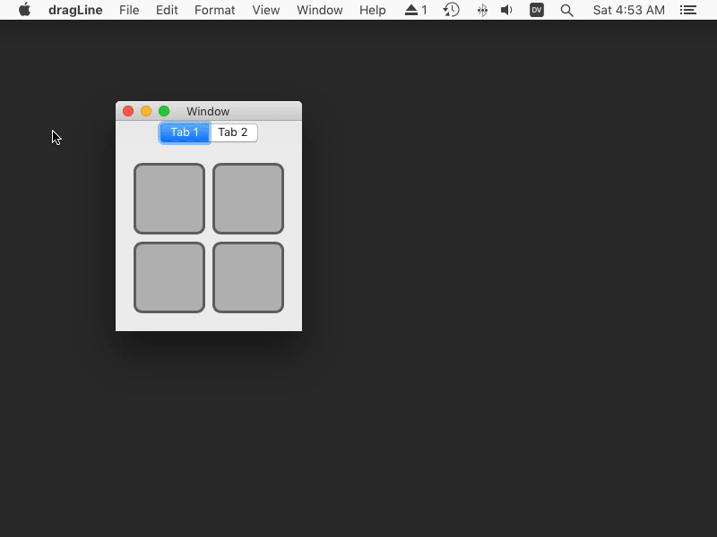

This repository contains the code from [my answer](http://stackoverflow.com/a/43699137/77567) to [“How to reproduce this Xcode blue drag line” on stackoverflow](http://stackoverflow.com/q/43688437/77567). The result looks like this:

