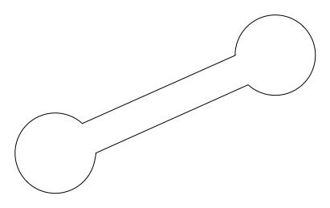
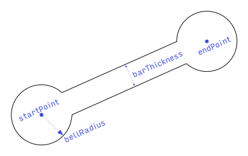
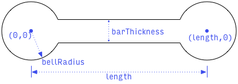
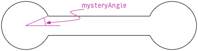
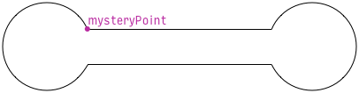
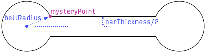
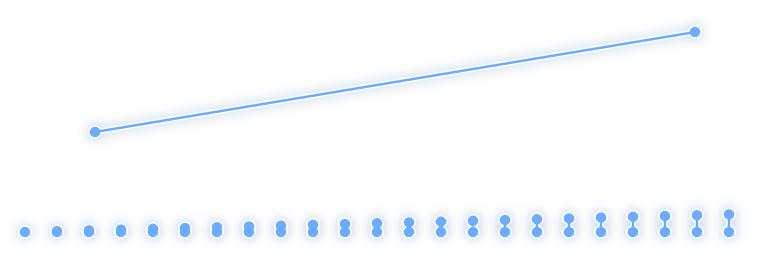
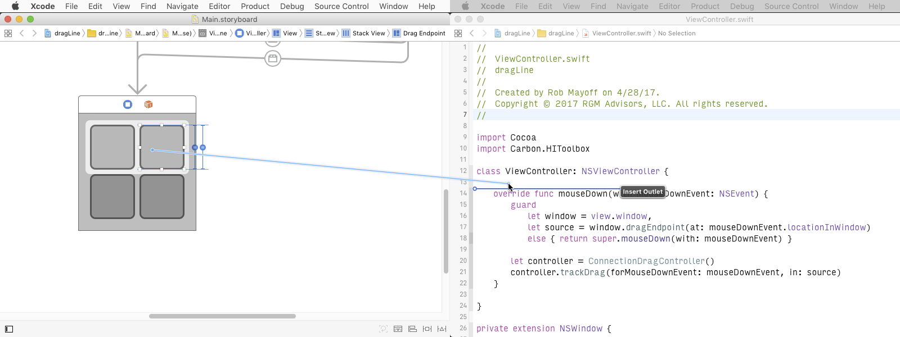

I'm posting this after you've posted your own answer, so this is probably a huge waste of time. But your answer only covers drawing a really bare-bones line on the screen and doesn't cover a bunch of other interesting stuff that you need to take care of to really replicate Xcode's behavior and even go beyond it:

- drawing a nice connection line like Xcode's (with a shadow, an outline, and big rounded ends),
- drawing the line across multiple screens,
- using Cocoa drag and drop to find the drag target and to support spring-loading.

Here's a demo of what I'm going to explain in this answer:

[In this github repo](TODO: insert link here), you can find an Xcode project containing all the code in this answer plus the remaining glue code necessary to run a demo app.

## Drawing a nice connection line like Xcode's

Xcode's connection line looks like an [old-timey barbell](https://www.google.com/search?tbm=isch&q=old-timey+barbell). It has a straight bar of arbitrary length, with a circular bell at each end:

What do we know about that shape? The user provides the start and end points (the centers of the bells) by dragging the mouse, and our user interface designer specifies the radius of the bells and the thickness of the bar:

The length of the bar is the distance from `startPoint` to `endPoint`: `length = hypot(endPoint.x - startPoint.x, endPoint.y - startPoint.y)`.

To simplify the process of creating a path for this shape, let's draw it in a standard pose, with the left bell at the origin and the bar parallel to the x axis. In this pose, here's what we know:

We can create this shape as a path by making a circular arc centered at the origin, connected to another (mirror image) circular arc centered at `(length, 0)`. To create these arcs, we need this `mysteryAngle`:

We can figure out `mysteryAngle` if we can find any of the arc endpoints where the bell meets the bar. Specifically, we'll find the coordinates of this point:

What do we know about that `mysteryPoint`? We know it's at the intersection of the bell and the top of the bar. So we know it's at distance `bellRadius` from the origin, and at distance `barThickness / 2` from the x axis:

So immediately we know that `mysteryPoint.y = barThickness / 2`, and we can use the Pythagorean theorem to compute `mysteryPoint.x = sqrt(bellRadius² - mysteryPoint.y²)`.

With `mysteryPoint` located, we can compute `mysteryAngle` using our choice of inverse trigonometry function. Arcsine, I choose you! `mysteryAngle = asin(mysteryPoint.y / bellRadius)`.

We now know everything we need to create the path in the standard pose. To move it from the standard pose to the desired pose (which goes from `startPoint` to `endPoint`, remember?), we'll apply an affine transform. The transform will translate (move) the path so the left bell is centered at `startPoint` and rotate the path so the right bell ends up at `endPoint`.

In writing the code to create the path, we want to be careful of a few things:

- What if the length is so short that the bells overlap? We should handle that gracefully by adjusting `mysteryAngle` so the bells connect seamlessly with no weird “negative bar” between them.

- What if `bellRadius` is smaller than `barThickness / 2`? We should handle that gracefully by forcing `bellRadius` to be at least `barThickness / 2`.

- What if `length` is zero? We need to avoid division by zero.

Here's my code to create the path, handling all those cases:

	extension CGPath {
	    class func barbell(from start: CGPoint, to end: CGPoint, barThickness proposedBarThickness: CGFloat, bellRadius proposedBellRadius: CGFloat) -> CGPath {
	        let barThickness = max(0, proposedBarThickness)
	        let bellRadius = max(barThickness / 2, proposedBellRadius)
	
	        let vector = CGPoint(x: end.x - start.x, y: end.y - start.y)
	        let length = hypot(vector.x, vector.y)
	
	        if length == 0 {
	            return CGPath(ellipseIn: CGRect(origin: start, size: .zero).insetBy(dx: -bellRadius, dy: -bellRadius), transform: nil)
	        }
	
	        var yOffset = barThickness / 2
	        var xOffset = sqrt(bellRadius * bellRadius - yOffset * yOffset)
	        let halfLength = length / 2
	        if xOffset > halfLength {
	            xOffset = halfLength
	            yOffset = sqrt(bellRadius * bellRadius - xOffset * xOffset)
	        }
	
	        let jointRadians = asin(yOffset / bellRadius)
	        let path = CGMutablePath()
	        path.addArc(center: .zero, radius: bellRadius, startAngle: jointRadians, endAngle: -jointRadians, clockwise: false)
	        path.addArc(center: CGPoint(x: length, y: 0), radius: bellRadius, startAngle: .pi + jointRadians, endAngle: .pi - jointRadians, clockwise: false)
	        path.closeSubpath()
	
	        let unitVector = CGPoint(x: vector.x / length, y: vector.y / length)
	        var transform = CGAffineTransform(a: unitVector.x, b: unitVector.y, c: -unitVector.y, d: unitVector.x, tx: start.x, ty: start.y)
	        return path.copy(using: &transform)!
	    }
	}

Once we have the path, we need to fill it with the correct color, stroke it with the correct color and line width, and draw a shadow around it. I used Hopper Disassembler on `IDEInterfaceBuilderKit` to figure out Xcode's exact sizes and colors. Xcode draws it all into a graphics context in a custom view's `drawRect:`, but we'll make our custom view use a `CAShapeLayer`. We won't end up drawing the shadow *precisely* the same as Xcode, but it's close enough.

	class ConnectionView: NSView {
	    struct Parameters {
	        var startPoint = CGPoint.zero
	        var endPoint = CGPoint.zero
	        var barThickness = CGFloat(2)
	        var ballRadius = CGFloat(3)
	    }
	
	    var parameters = Parameters() { didSet { needsLayout = true } }
	
	    override init(frame: CGRect) {
	        super.init(frame: frame)
	        commonInit()
	    }
	
	    required init?(coder decoder: NSCoder) {
	        super.init(coder: decoder)
	        commonInit()
	    }
	
	    let shapeLayer = CAShapeLayer()
	    override func makeBackingLayer() -> CALayer { return shapeLayer }
	
	    override func layout() {
	        super.layout()
	
	        shapeLayer.path = CGPath.barbell(from: parameters.startPoint, to: parameters.endPoint, barThickness: parameters.barThickness, bellRadius: parameters.ballRadius)
	        shapeLayer.shadowPath = CGPath.barbell(from: parameters.startPoint, to: parameters.endPoint, barThickness: parameters.barThickness + shapeLayer.lineWidth / 2, bellRadius: parameters.ballRadius + shapeLayer.lineWidth / 2)
	    }
	
	    private func commonInit() {
	        wantsLayer = true
	
	        shapeLayer.lineJoin = kCALineJoinMiter
	        shapeLayer.lineWidth = 0.75
	        shapeLayer.strokeColor = NSColor.white.cgColor
	        shapeLayer.fillColor = NSColor(calibratedHue: 209/360, saturation: 0.83, brightness: 1, alpha: 1).cgColor
	        shapeLayer.shadowColor = NSColor.selectedControlColor.blended(withFraction: 0.2, of: .black)?.withAlphaComponent(0.85).cgColor
	        shapeLayer.shadowRadius = 3
	        shapeLayer.shadowOpacity = 1
	        shapeLayer.shadowOffset = .zero
	    }
	}

We can test this in a playground to make sure it looks good:

    import PlaygroundSupport

    let view = NSView()
    view.setFrameSize(CGSize(width: 400, height: 200))
    view.wantsLayer = true
    view.layer!.backgroundColor = NSColor.white.cgColor

    PlaygroundPage.current.liveView = view

    for i: CGFloat in stride(from: 0, through: 9, by: CGFloat(0.4)) {
        let connectionView = ConnectionView(frame: view.bounds)
        connectionView.parameters.startPoint = CGPoint(x: CGFloat(i) * 40 + 15, y: 50)
        connectionView.parameters.endPoint = CGPoint(x: CGFloat(i) * 40 + 15, y: 50 + CGFloat(i))
        view.addSubview(connectionView)
    }

    let connectionView = ConnectionView(frame: view.bounds)
    connectionView.parameters.startPoint = CGPoint(x: 50, y: 100)
    connectionView.parameters.endPoint = CGPoint(x: 350, y: 150)
    view.addSubview(connectionView)

Here's the result:

## Drawing across multiple screens

If you have multiple screens (displays) attached to your Mac, and if you have “Displays have separate Spaces” turned on (which is the default) in the Mission Control panel of your System Preferences, then macOS will not let a window span two screens. This means that you can't use a single window to draw the connecting line across multiple monitors. This matters if you want to let the user connect an object in one window to an object in another window, like Xcode does:

Here's the checklist for drawing the line, across multiple screens, on top of our other windows:

- We need to create one window per screen.
- We need to set up each window to fill its screen and be completely transparent with no shadow.
- We need to set the window level of each window to 1 to keep it above our normal windows (which have a window level of 0).
- We need to tell each window **not** to release itself when closed, because we don't like mysterious autorelease pool crashes.
- Each window needs its own `ConnectionView`.
- To keep the coordinate systems uniform, we'll adjust the `bounds` of each `ConnectionView` so that its coordinate system matches the screen coordinate system.
- We'll tell each `ConnectionView` to draw the entire connecting line; each view will clip what it draws to its own bounds.
- It probably won't happen, but we'll arrange to be notified if the screen arrangement changes. If that happens, we'll add/remove/update windows to cover the new arrangement.

Let's make a class to encapsulate all these details. With an instance of `LineOverlay`, we can update the start and end points of the connection as needed, and remove the overlay from the screen when we're done.

	class LineOverlay {
	
	    init(startScreenPoint: CGPoint, endScreenPoint: CGPoint) {
	        self.startScreenPoint = startScreenPoint
	        self.endScreenPoint = endScreenPoint
	
	        NotificationCenter.default.addObserver(self, selector: #selector(LineOverlay.screenLayoutDidChange(_:)), name: .NSApplicationDidChangeScreenParameters, object: nil)
	        synchronizeWindowsToScreens()
	    }
	
	    var startScreenPoint: CGPoint { didSet { setViewPoints() } }
	
	    var endScreenPoint: CGPoint { didSet { setViewPoints() } }
	
	    func removeFromScreen() {
	        windows.forEach { $0.close() }
	        windows.removeAll()
	    }
	
	    private var windows = [NSWindow]()
	
	    deinit {
	        NotificationCenter.default.removeObserver(self)
	        removeFromScreen()
	    }
	
	    @objc private func screenLayoutDidChange(_ note: Notification) {
	        synchronizeWindowsToScreens()
	    }
	
	    private func synchronizeWindowsToScreens() {
	        var spareWindows = windows
	        windows.removeAll()
	        for screen in NSScreen.screens() ?? [] {
	            let window: NSWindow
	            if let index = spareWindows.index(where: { $0.screen === screen}) {
	                window = spareWindows.remove(at: index)
	            } else {
	                let styleMask = NSWindowStyleMask.borderless
	                window = NSWindow(contentRect: .zero, styleMask: styleMask, backing: .buffered, defer: true, screen: screen)
	                window.contentView = ConnectionView()
	                window.isReleasedWhenClosed = false
	                window.ignoresMouseEvents = true
	            }
	            windows.append(window)
	            window.setFrame(screen.frame, display: true)
	
	            // Make the view's geometry match the screen geometry for simplicity.
	            let view = window.contentView!
	            var rect = view.bounds
	            rect = view.convert(rect, to: nil)
	            rect = window.convertToScreen(rect)
	            view.bounds = rect
	
	            window.backgroundColor = .clear
	            window.isOpaque = false
	            window.hasShadow = false
	            window.isOneShot = true
	            window.level = 1
	
	            window.contentView?.needsLayout = true
	            window.orderFront(nil)
	        }
	
	        spareWindows.forEach { $0.close() }
	    }
	
	    private func setViewPoints() {
	        for window in windows {
	            let view = window.contentView! as! ConnectionView
	            view.parameters.startPoint = startScreenPoint
	            view.parameters.endPoint = endScreenPoint
	        }
	    }
	
	}

## Using Cocoa drag and drop to find the drag target and perform spring-loading

We need a way to find the (potential) drop target of the connection as the user drags the mouse around. It would also be nice to support spring loading.

In case you don't know, spring loading is a macOS feature in which, if you hover a drag over a container for a moment, macOS will automatically open the container without interrupting the drag. Examples:

- If you drag onto a window that's not the frontmost window, macOS will bring the window to the front.
- if you drag onto a Finder folder icon, and the Finder will open the folder window to let you drag onto an item in the folder.
- If you drag onto a tab handle (at the top of the window) in Safari or Chrome, the browser will select the tab, letting you drop your item in the tab. 
- If you control-drag a connection in Xcode onto a menu item in the menu bar in your storyboard or xib, Xcode will open the item's menu.

If we use the standard Cocoa drag and drop support to track the drag and find the drop target, then we'll get spring loading support “for free”.

To support standard Cocoa drag and drop, we need to implement the `NSDraggingSource` protocol on some object, so we can drag *from* something, and the `NSDraggingDestination` protocol on some other object, so we can drag *to* something. We'll implement `NSDraggingSource` in a class called `ConnectionDragController`, and we'll implement `NSDraggingDestination` in a custom view class called `DragEndpoint`.

First, let's look at `DragEndpoint` (an `NSView` subclass). `NSView` already conforms to `NSDraggingDestination`, but doesn't do much with it. We need to implement four methods of the `NSDraggingDestination` protocol. The drag session will call these methods to let us know when the drag enters and leaves the destination, when the drag ends entirely, and when to “perform” the drag (assuming this destination was where the drag actually ended). We also need to register the type of dragged data that we can accept.

We want to be careful of two things:

- We only want to accept a drag that is a connection attempt. We can figure out whether a drag is a connection attempt by checking whether the source is our custom drag source, `ConnectionDragController`.
- We'll make `DragEndpoint` appear to be the drag source (visually only, not programmatically). We don't want to let the user connect an endpoint to itself, so we need to make sure the endpoint that is the source of the connection cannot also be used as the target of the connection. We'll do that using a `state` property that tracks whether this endpoint is idle, acting as the source, or acting as the target.

When the user finally releases the mouse button over a valid drop destination, the drag session makes it the destination's responsibility to “perform” the drag by sending it `performDragOperation(_:)`. The session doesn't tell the drag source where the drop finally happened. But we probably want to do the work of making the connection (in our data model) back in the source. Think about how it works in Xcode: when you control-drag from a button in `Main.storyboard` to `ViewController.swift` and create an action, the connection is not recorded in `ViewController.swift` where the drag ended; it's recorded in `Main.storyboard`, as part of the button's persistent data. So when the drag session tells the destination to “perform” the drag, we'll make our destination (`DragEndpoint`) pass itself back to a `connect(to:)` method on the drag source where the real work can happen.

	class DragEndpoint: NSView {
	
	    enum State {
	        case idle
	        case source
	        case target
	    }
	
	    var state: State = State.idle { didSet { needsLayout = true } }
	
	    public override func draggingEntered(_ sender: NSDraggingInfo) -> NSDragOperation {
	        guard case .idle = state else { return [] }
	        guard (sender.draggingSource() as? ConnectionDragController)?.sourceEndpoint != nil else { return [] }
	        state = .target
	        return sender.draggingSourceOperationMask()
	    }
	
	    public override func draggingExited(_ sender: NSDraggingInfo?) {
	        guard case .target = state else { return }
	        state = .idle
	    }
	
	    public override func draggingEnded(_ sender: NSDraggingInfo?) {
	        guard case .target = state else { return }
	        state = .idle
	    }
	
	    public override func performDragOperation(_ sender: NSDraggingInfo) -> Bool {
	        guard let controller = sender.draggingSource() as? ConnectionDragController else { return false }
	        controller.connect(to: self)
	        return true
	    }
	    
	    override init(frame: NSRect) {
	        super.init(frame: frame)
	        commonInit()
	    }
	
	    required init?(coder decoder: NSCoder) {
	        super.init(coder: decoder)
	        commonInit()
	    }
	
	    private func commonInit() {
	        wantsLayer = true
	        register(forDraggedTypes: [kUTTypeData as String])
	    }
	
	    // Drawing code omitted here but is in my github repo.
    }

Now we can implement `ConnectionDragController` to act as the drag source and to manage the drag session and the `LineOverlay`.

- To start a drag session, we have to call `beginDraggingSession(with:event:source:)` on a view; it'll be the `DragEndpoint` where the mouse-down event happened.
- The session notifies the source when the drag actually starts, when it moves, and when it ends. We use those notifications to create and update the `LineOverlay`.
- Since we're not providing any images as part of our `NSDraggingItem`, the session won't draw anything being dragged. This is good.
- By default, if the drag ends outside of a valid destination, the session will animate… nothing… back to the start of the drag, before notifying the source that the drag has ended. During this animation, the line overlay hangs around, frozen. It looks broken. We tell the session not to animate back to the start to avoid this.

Since this is just a demo, the “work” we do to connect the endpoints in `connect(to:)` is just printing their descriptions. In a real app, you'd actually modify your data model.
 
	class ConnectionDragController: NSObject, NSDraggingSource {
	
	    var sourceEndpoint: DragEndpoint?
	
	    func connect(to target: DragEndpoint) {
	        Swift.print("Connect \(sourceEndpoint!) to \(target)")
	    }
	
	    func trackDrag(forMouseDownEvent mouseDownEvent: NSEvent, in sourceEndpoint: DragEndpoint) {
	        self.sourceEndpoint = sourceEndpoint
	        let item = NSDraggingItem(pasteboardWriter: NSPasteboardItem(pasteboardPropertyList: "\(view)", ofType: kUTTypeData as String)!)
	        let session = sourceEndpoint.beginDraggingSession(with: [item], event: mouseDownEvent, source: self)
	        session.animatesToStartingPositionsOnCancelOrFail = false
	    }
	
	    func draggingSession(_ session: NSDraggingSession, sourceOperationMaskFor context: NSDraggingContext) -> NSDragOperation {
	        switch context {
	        case .withinApplication: return .generic
	        case .outsideApplication: return []
	        }
	    }
	
	    func draggingSession(_ session: NSDraggingSession, willBeginAt screenPoint: NSPoint) {
	        sourceEndpoint?.state = .source
	        lineOverlay = LineOverlay(startScreenPoint: screenPoint, endScreenPoint: screenPoint)
	    }
	
	    func draggingSession(_ session: NSDraggingSession, movedTo screenPoint: NSPoint) {
	        lineOverlay?.endScreenPoint = screenPoint
	    }
	
	    func draggingSession(_ session: NSDraggingSession, endedAt screenPoint: NSPoint, operation: NSDragOperation) {
	        lineOverlay?.removeFromScreen()
	        sourceEndpoint?.state = .idle
	    }
	
	    func ignoreModifierKeys(for session: NSDraggingSession) -> Bool { return true }
	
	    private var lineOverlay: LineOverlay?
	
	}

That's all you need. As a reminder, you can find a link at the top of this answer to a github repo containing a complete demo project.
